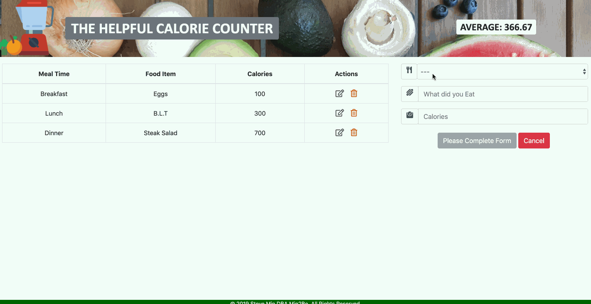

# Live Site - http://calories.stevekmin.com

# The Helpful Calorie Counter
The Helpful Calorie Counter application is a full stack app that allows user to keep track of their caloric intake.  The application allows users to Create, Read, Update, and Delete custom inputs related to their caloric intake.  

# Getting Started 
Fork this repo and clone your fork from the terminal.  
- `git clone https://github.com/skmmks/counting_calories.git`  

Navigate into the cloned directory and install the necessary dependencies.  
- `npm install`  

Start a dev environment with access to Apache2:  
- Check that port is directed to 3000  
- Check that the root directory of the server is set to the public folder  

Run the `dev` script to start dev server  
- `npm run dev`  

Navigate to `localhost:3000` to use the application

# Technologies Used
- Javascript 
- React.js
- Reactstrap - Used for desktop and mobile views
- Node.js

